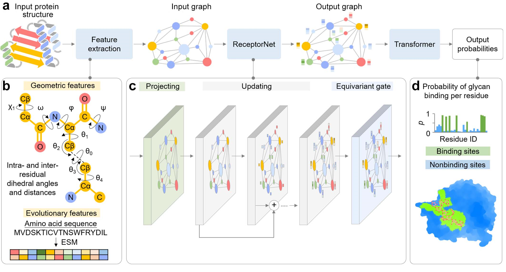

# DeepGlycanSite: A Highly Accurate Carbohydrate-binding Site Prediction Algorithm

Official implementation of **DeepGlycanSite**, a state-of-the-art method for carbohydrate-binding site prediction.
This repository contains all code, instructions, and model weights necessary to run the method or to retrain a model. 
If you have any questions, feel free to open an issue or reach out to us: [xicheng@simm.ac.cn](xicheng@simm.ac.cn)

# Description

**DeepGlycanSite** is an open-source method for carbohydrate-binding site detection, with or without known glycan. It can perform a whole range of carbohydrate-binding site prediction tasks.

**Things DeepGlycanSite can do**
- Discover common glycan binding site based on protein structure
- Discover binding site for specified glycan based on protein structure
- Guide mutation design for known glycan targets

----

# Table of contents
1. [Dataset](#dataset)
2. [Setup Environment](#setup-environment)
   1. [For CPU](#For-CPU)
   2. [For GPU](#For-GPU)
4. [Running DeepGlycanSite on test system](#running-deepglycansite-on-test-system)
5. [Retraining DeepGlycanSite](#retraining-deepglycansite)
6. [License](#license)

# Dataset

If you want to train one of our models with the data then: 
1. download pdb ids from dataset/
2. divide them into ligands and proteins
2. unzip the directory and place it into `data` such that you have the path `data/PDBBind_processed`

# Setup Environment

We will set up the environment using [Anaconda](https://docs.anaconda.com/anaconda/install/index.html). Clone the current repo

    git clone https://github.com/xichengeva/DeepGlycanSite.git

This is an example of how to set up a working conda environment to run the code (but make sure to use the correct pytorch, pytorch-geometric, cuda versions, or cpu only versions):

    conda create --name DeepGlycanSite python=3.9
    conda activate DeepGlycanSite

## For CPU:

    pip install torch==1.13.1+cpu torchvision==0.14.1+cpu torchaudio==0.13.1 --extra-index-url https://download.pytorch.org/whl/cpu
    pip install torch_geometric==2.3.0
    pip install "fair-esm[esmfold]"
    pip install pyg_lib torch_scatter torch_sparse torch_cluster torch_spline_conv -f https://data.pyg.org/whl/torch-1.13.1+cpu.html
    pip install pytorch-lightning==1.9.3 &&    pip install h5py==3.8.0 && pip install rdkit==2022.9.5 && pip install Bio==1.5.5 && pip install pandas==1.5.3 &&  pip install MDAnalysis==2.4.2  && pip install pymatgen==2023.7.20  && pip install tokenizers==0.13.3 && pip install lmdb==1.4.1 && pip install addict==2.4.0 && pip install transformers==4.30.0

## For GPU:

    pip install torch==1.13.1+cu116 torchvision==0.14.1+cu116 torchaudio==0.13.1 --extra-index-url https://download.pytorch.org/whl/cu116
    pip install torch-geometric==2.3.0
    pip install "fair-esm[esmfold]"
    pip install torch-scatter torch-sparse torch-cluster torch-spline-conv torch-geometric -f https://data.pyg.org/whl/torch-1.13.1+cu116.html
    pip install pytorch-lightning==1.9.3 && pip install h5py && pip install rdkit==2022.9.5 && pip install Bio==1.5.5 && pip install pandas==1.5.3 &&  pip install MDAnalysis==2.4.2  && pip install pymatgen==2023.7.20  && pip install tokenizers==0.13.3 && pip install lmdb==1.4.1 && pip install addict==2.4.0 && pip install transformers==4.30.0

Installation may take 1 hours on a normal desktop computer.

# Running DeepGlycanSite on test system 

The protein inputs need to be `.pdb` files. The ligand input needs to be `.sdf` files. Both the files need HYDROGENS to be added.

Run inference with only receptor:

    python single_case_prediction.py --conf P2Y14_example/hparams_rec.yaml  --ckpt_path ckpts/rec_only.ckpt --input_fn P2Y14_example/P2Y14_AF.pdb  --out_path P2Y14_example/ --output_fn P2Y14_af.txt

P2Y14_example/P2Y14_af.txt will be the output file and the second column is the probability for prediction

Run inference with receptor and ligand:

    python single_case_prediction.py --conf hparams.yaml  --ckpt_path ckpts/with_ligand.ckpt --input_fn P2Y14_example/P2Y14_AF.pdb,P2Y14_example/GDP.sdf --out_path P2Y14_example/ --output_fn P2Y14_af_GDP.txt

Use a comma to connect pdb and ligand sdf to activate DeepGlycanSite+ligand model, P2Y14_example/P2Y14_af_GDP.txt will be the output file

If auto-download fails, you can also download the checkpoints from https://huggingface.co/Xinheng/DeepGlycanSite/tree/main or https://zenodo.org/records/10065607, just put rec_only.ckpt and with_ligand.ckpt to ./ckpt, and mol_pre_all_h_220816.pt to ./src/unimol_tools/weights

Running per line takes 1-3 minutes on a normal desktop computer.

# Retraining DeepGlycanSite
Use single_case_prediction.py for per protein and ligands, then combine the .pt files in out_path, and you can train it with DeepGlycanSite.py or DeepGlycanSite_lig.py with following codes:

    python DeepGlycanSite.py --conf P2Y14_example/hparams_rec.yaml --output-path DeepGlycanSite_rec
    
    python DeepGlycanSite_lig.py --conf P2Y14_example/hparams.yaml --output-path DeepGlycanSite_lig

# License
Apache License 2.0
